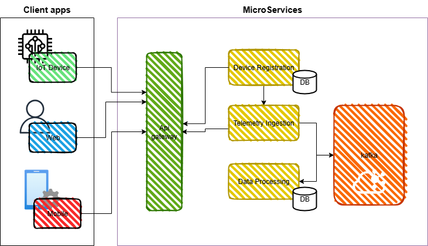

# Microservice iot spring boot

A comprehensive microservices-based IoT platform built with Spring Cloud for device registration and telemetry data processing.

## Description
This project implements a distributed IoT telemetry management system that enables device registration, real-time telemetry data ingestion, and data processing using Spring Cloud microservices architecture. The platform provides scalable solutions for managing IoT devices and processing their telemetry data streams.


## Architecture
The system consists of the following microservices:



- **Eureka Server**: Service discovery and registration
- **Config Server**: Centralized configuration management
- **API Gateway**: Single entry point with routing and load balancing
- **Device Registration Service**: Manages IoT device lifecycle and metadata
- **Telemetry Ingestion Service**: Handles real-time telemetry data collection
- **Data Processing Service**: Processes and analyzes telemetry data

## Technology Stack

- **Spring Boot 3.x**: Microservice framework
- **Spring Cloud 2025.x**: Cloud-native patterns and tools
- **PostgreSQL**: Primary database for device and processed data
- **TimescaleDB**: Time-series database for telemetry data
- **Apache Kafka**: Message streaming platform
- **Docker Compose**: Container orchestration
- **Maven**: Dependency management
- **Resilience4j**: Circuit breaker and fault tolerance library

## Features

- Device registration and management
- Real-time telemetry data ingestion
- Scalable microservices architecture
- Service discovery with Eureka
- Centralized configuration management
- API Gateway with routing
- Message-driven architecture with Kafka
- Time-series data storage
- Docker containerization

## Getting Started

### Prerequisites

- Java 17+
- Docker and Docker Compose
- Maven 3.8+

### Quick Start

1. **Clone the repository**
   ```bash
   git clone <repository-url>
   cd spring-cloud
   ```
2. **Start the infrastructure services**
    ```bash
    docker-compose up -d postgres timescaledb kafka zookeeper
    ```

3. **Start the Spring Cloud services**
    ```bash
    docker-compose up -d eureka-server config-server
    docker-compose up -d api-gateway device-registration-service
    docker-compose up -d telemetry-ingestion-service data-processing-service
    ```

4. **Verify services are running**
    - Eureka Dashboard: http://localhost:8761
    - API Gateway: http://localhost:9090
    - Config Server: http://localhost:8888


**API Endpoints**

```bash
# Register a new device
POST http://localhost:9090/api/devices
{
    "name": "Dispositivo de prueba",
    "status": "Activo",
    "description": "Descripcion de prueba",
    "type": "IOT"
}

# Get all devices
GET http://localhost:9090/api/devices

# Get device by ID
GET http://localhost:9090/api/devices/{deviceId}
```

**Telemetry Data**

```bash
# Send telemetry data
POST http://localhost:9090/api/telemetry/{deviceId}
{
  "temperature": 23.5,
  "humidity": 65.2
}
```

### Configuration
The system uses Spring Cloud Config for centralized configuration management. Configuration files are located in the config/ directory:

 - `api-gateway.properties`: Gateway routing configuration
 - `device-registration-service.properties`: Database and service configuration
 - `telemetry-ingestion-service.properties`: Kafka and messaging configuration


 ### Development
Running Locally
Each microservice can be run independently for development:

```bash
# Start Config Server first
cd config-server
mvn spring-boot:run

# Start Eureka Server
cd eureka-server
mvn spring-boot:run

# Start individual services
cd device-registration-service
mvn spring-boot:run
```

Building Docker Images

```bash
# Build all services
docker-compose build

# Build specific service
docker-compose build device-registration-service
```

## Monitoring
- Eureka Dashboard: Service registry and health status
- Actuator Endpoints: Health checks and metrics for each service
- Kafka UI: Message broker monitoring (optional)

